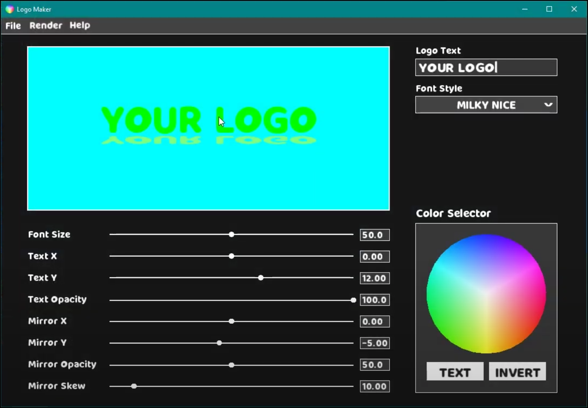

# Academic-Projects

Games and programs that I've made at Pasadena City College.

Logo Maker (C++, SFML) | Big 2 (C++, SFML) Escape Room (C++) | Escape Room (C++)
:-------------------------:|:-------------------------:|:-------------------------:
GitHub: https://github.com/JonathanCNg/Logo-Maker   | GitHub: https://github.com/JonathanCNg/Big-2-Game  | GitHub: https://github.com/JonathanCNg/Escape-Room-Game 

### Logo Maker (C++, SFML)

GitHub: https://github.com/JonathanCNg/Logo-Maker

### Big 2 (C++, SFML)

GitHub: https://github.com/JonathanCNg/Big-2-Game

### Escape Room (C++)

GitHub: https://github.com/JonathanCNg/Escape-Room-Game
