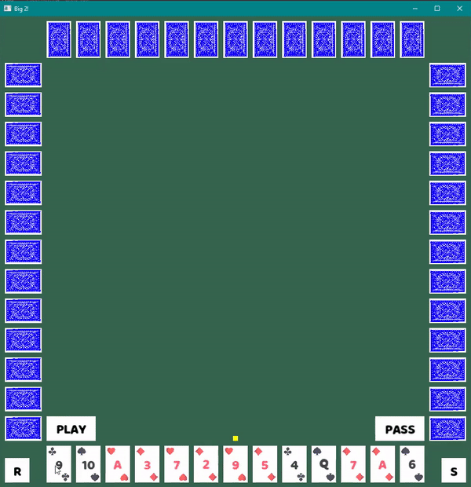
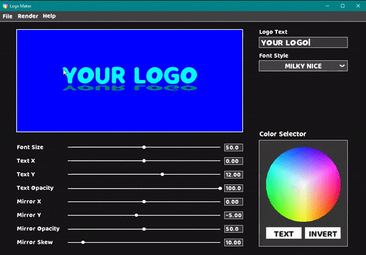
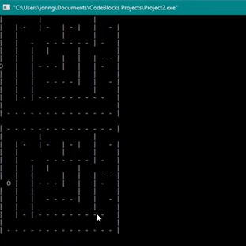

# Academic-Projects

Games and programs that I've made at Pasadena City College.

AIs | #1 Minesweeper AI | #2 Big 2
:-------------------------:|:-------------------------:|:-------------------------:
**Sample** |  | 
**Tools** | [Python](https://www.python.org/) | [C++](https://www.cplusplus.com/), [SFML](https://www.sfml-dev.org/)
**GitHub** | [Minesweeper AI Repo](https://github.com/JonathanCNg/Minesweeper-AI) | [Big 2 Repo](https://github.com/JonathanCNg/Big-2-Game)

More | #3 Logo Editor | #4 Escape Room 
:-------------------------:|:-------------------------:|:-------------------------:
**Sample** |  | 
**Tools** | [C++](https://www.cplusplus.com/), [SFML](https://www.sfml-dev.org/) | [C++](https://www.cplusplus.com/)
**GitHub** | [Logo Editor Repo](https://github.com/JonathanCNg/Logo-Editor) | [Escape Room Repo](https://github.com/JonathanCNg/Escape-Room-Game)
